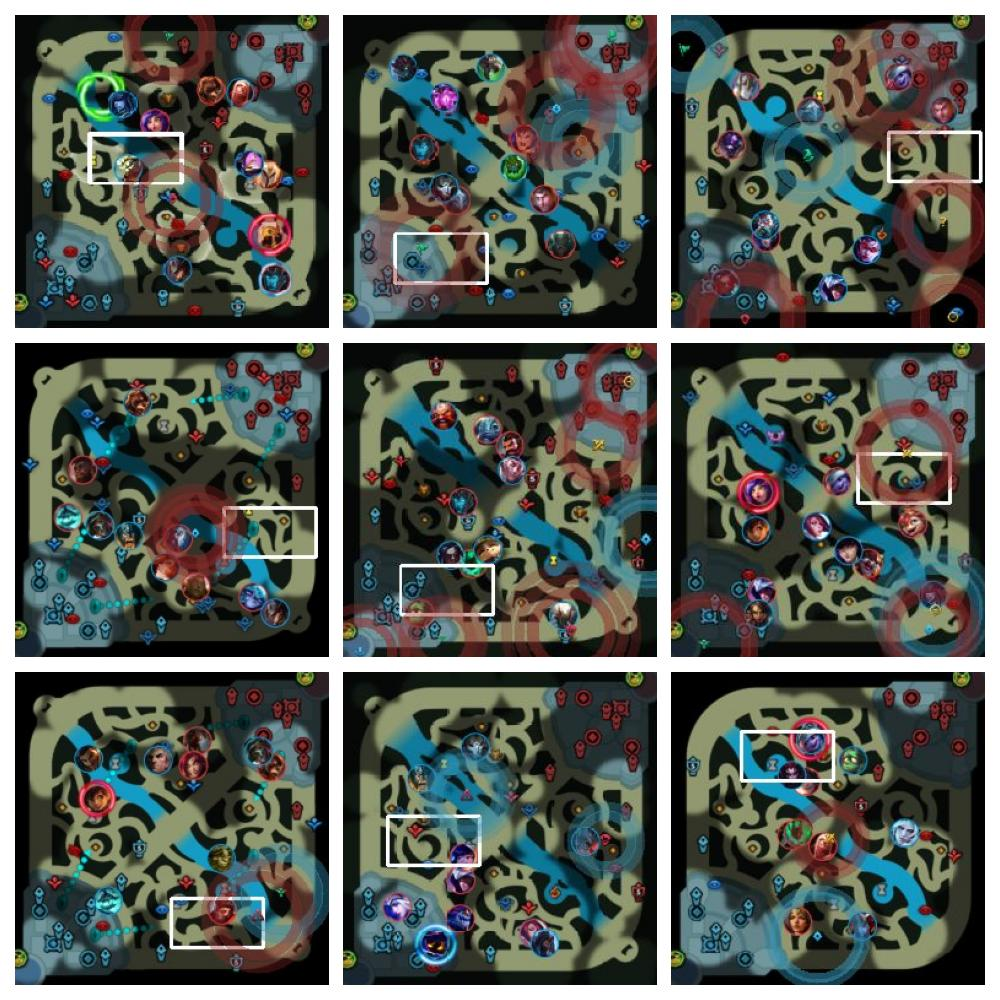

# League of Legends Synthetic Minimap Dataset (Sample)



## ⚠️ Dataset Note

> **This repository contains a small sample (1000 images) of the synthetic dataset.**
>
> To generate the full **image dataset** of any size used for training high-performance models, please use the generator script available in my GitHub repository:
>
> 👉 **[[my_github](https://github.com/bsowlx/DeepestLeague)]**

## Dataset Description

This dataset consists of synthetically generated League of Legends minimap images designed for training object detection models (specifically YOLO). It utilizes a complex rendering pipeline to simulate various game states, vision conditions, and champion positions.

### Key Features

* **Fog of War Simulation:** Randomly generated fog masks to simulate limited vision.
* **Map Objects:** Dynamic placement of Towers, Inhibitors, Nexus, Jungle Monsters, and Baron/Dragon.
* **Game Effects:** Simulates **Recall** (Blue/Red), **Teleport**, **Ping** waves, and other artifacts to mimic noisy real-world gameplay.
* **Observer Viewport:** Generates a white "camera" rectangle simulating the observer mode.
* **Augmentations:**
    * **JPEG Compression Noise:** Enabled by default to mimic stream artifacts.
    * **Icon Overlap:** Champions can cluster together (simulating teamfights).
    * **Background/Icon Augments:** Blur, downscaling, and color distortion options.

## File Structure

* `train/`, `val/`, `test/`: Image splits.
* `labels/`: Standard YOLO labels (`class_id x_center y_center width height`).
* `viewport_labels/`: Coordinates for the observer camera rectangle (`x y w h` in pixels).
* `data.yaml`: Dataset configuration file compatible with YOLOv8/v11 training.

## How to Generate the Full Dataset

Clone the repository and run the generator script. The script uses `multiprocessing` to generate data quickly.

### Recommended Command (High Quality)

```bash
# Generates 100k training images at 256x256 resolution
python -m scripts.data.synthetic_data_generator \
  --n-train 100000 \
  --n-val 10000 \
  --n-test 10000 \
  --imgsz 256 \
  --dataset-name lol_minimap_synthetic \
  --viewport-sim